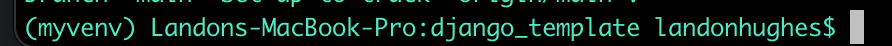
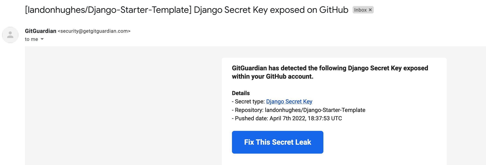

# Django Starter Template (macOS)

## Basic Structure

1. Install the virtualenv pip package globally (if it hasn't already been installed). Type `pip3 install virtualenv` into the terminal then hit enter.
2. Create a new virtual environment with `virtualenv <my-venv-name>`.
3. Activate the virtual environment with `source <my-venv-name>/bin/activate`. This is essentially a little sandbox for your django project. You can have multiple django projects on your computer without any conflicts by utilizing virtual environments.
4. You should see the name of the virtual environment in parentheses on the left of your terminal. This signals that it was activated correctly.
   
5. Now create a new django project with `django-admin startproject <my-project-name>`.
6. Now it's time to install some packages!

## Packages Installation

In your terminal:

1. `pip install psycopg2-binary pillow requests python-dotenv whitenoise`.
2. `python3 -m pip install django-browser-reload`.
3. Packages are installed! Onto database setup.

## Database Setup (PostgreSQL)

1. Download the postgres.app from [https://postgresapp.com/downloads.html](https://postgresapp.com/downloads.html).
2. Follow installation instructions.
3. Open the postgres.app.
4. Click "Initialize".
5. Double click on the postgres database.
6. Type `\password` then create a strong password.
7. Type `CREATE DATABASE <name of your database>;`. Don't forget to remove the angle brackets! 👍
8. Your database is now setup. Time to configure a new .env file!

## Environment Setup

1. Create a .gitignore file and use the template from [https://www.toptal.com/developers/gitignore/api/django](https://www.toptal.com/developers/gitignore/api/django) .
2. Create a new .env file. Copy what is in `.env.template` and paste it into your new .env file.
3. Fill in the placeholder values with information from the previous steps.
4. Leave `ENGINE` alone. Make sure HOST is `localhost` (for development purposes). Change the PORT number to 5432. This is the default port for postgres.
5. For the secret key, copy the value in `settings.py` and put that value into the .env file.
6. We are almost done with configuration and setup! Now for some code modification in `settings.py`.

## Settings.py

1. Add the following to the top of the file:

```python3
from dotenv import load_dotenv
import os
load_dotenv()

# Env variables
ENGINE = os.getenv("ENGINE")
DATABASE_NAME = os.getenv("NAME")
PASSWORD = os.getenv("PASSWORD")
HOST = os.getenv("HOST")
PORT = os.getenv("PORT")
SECRET = os.getenv("SECRET_KEY")
```

2. Now, scroll further down to database section. Replace what is there with:

```python3
DATABASES = {
    'default': {
        'ENGINE': ENGINE,
        'NAME': DATABASE_NAME,
        'PASSWORD': PASSWORD,
        'HOST': HOST,
        'PORT': PORT
    }
}
```

3. We are nearly there!
4. Change the current directory to your django project then Run `python manage.py migrate`. You can now delete the sqlite database that came with the django installation since we are now using postgres.
5. If all goes well, you should see no errors! Whoop whoop
6. Also, if you manage to leak your `SECRET_KEY` in `settings.py`, you will get an email from GitGuardian saying your key was exposed on Github. It's best to put this in a .env file from the start to prevent any security issues.

See: 

## Django Browser reload

Django Browser reload is a package I always use. If you make changes in any of your static files, this package will auto reload your browser for you reflecting those changes.
To install:

1. We did this earlier but run `python3 -m pip install django-browser-reload` if you forgot. This installs the package.
2. In `settings.py`, add

```python3
INSTALLED_APPS = [
    ...,
    "django_browser_reload",
    ...,
]
```

3. In `urls.py` in the root of your project, add the following to urlpatterns:

```python3
urlpatterns = [
    # ...
    path("__reload__/", include("django_browser_reload.urls")),
]
```

4. Finally, go to `settings.py` and add:

```python3
MIDDLEWARE = [
    # ...
    "django_browser_reload.middleware.BrowserReloadMiddleware",
    # ...
]
```

5. You are all set up with auto-reloading in Django! If you have more questions or want to see the original developer repository for django-browser-reload,
   you can do so [here](https://github.com/adamchainz/django-browser-reload).

## Static Files and Media Uploads Configuration

1. In the root `urls.py` file, add:

```python3
...
from django.conf import settings
from django.conf.urls.static import static
...

urlpatterns += static(settings.MEDIA_URL, document_root=settings.MEDIA_ROOT)
urlpatterns += static(settings.STATIC_URL, document_root=settings.STATIC_ROOT)
```

2. In `settings.py`, add:

```python3
# You can think of this like the "where", as in where should our links look if we add a logo to the home page.
STATIC_URL = 'static/'
# You can also think of this like the "where, as in what url should user uploaded images be pointed to. So, say a user uploaded an image called egg.png, the location of that image would look something like www.myfancywebsite.com/images/egg.png.
MEDIA_URL = "/images/"
# Inside our Django project, we need JS, CSS, and static content to make our site look fancy. You can think of the line below to tell Django "Hey, look here for these files".
STATICFILES_DIRS = [ BASE_DIR / "static" ]
# The line below tells Django, "Hey, store any user uploaded content to <root-folder-project-name>/static/images"
MEDIA_ROOT = BASE_DIR / "static/images"
# STATIC_ROOT is the exact same thing except, this is where our static files will go when we use `python manage.py collectstatic`.
STATIC_ROOT = BASE_DIR / "staticfiles"
```

3. We're done!

I hope someone on the internet finds this tutorial/template useful!
If you are cloning this repo, don't forget to `pip3 install -r requirements.txt` 👍
